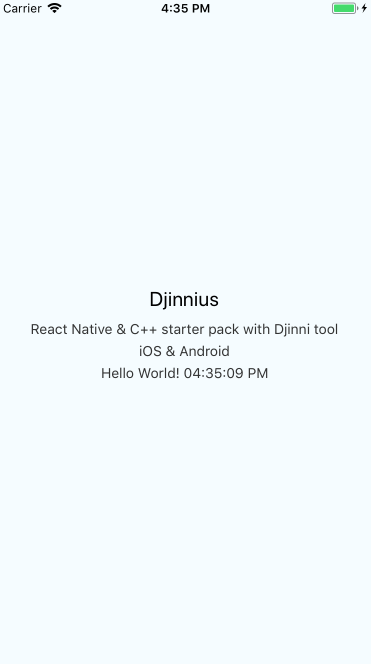
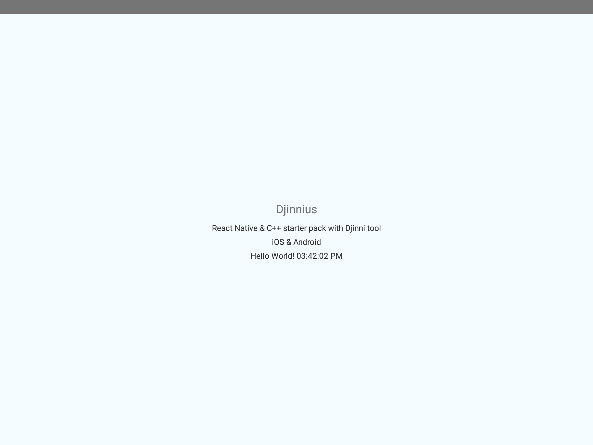

# Djinnius

:tractor: React Native & C++ starter pack with Djinni tool – iOS & Android

## Initial setup
```
git clone --recursive git@github.com:MathieuDebit/Djinnius.git
cd Djinnius/deps/gyp && git checkout -q 0bb67471bca068996e15b56738fa4824dfa19de0 && cd ../..
npm install or yarn install
sh ./run_djinni.sh
```

## To build and run on ios
    make ios
    react-native run-ios

## To build and run android

Make sur to create a local.properties in android directory which define :

    sdk.dir=<location to your android sdk>
    ndk.dir=<location to your android ndf>

Then run

    react-native run-android

---

## Troobleshooting android 

1. If you encounter the following error : 

        $ANDROID_BUILD_TOP not set; you need to run lunch.

    Edit `Makefile` and replace :

        $(shell dirname `which ndk-build`)

    By your NDK location

2. If you encounter (at compilation) time the following message :

       error: unknown warning option '-Wno-literal-suffix'; did you mean '-Wno-literal-range'? [-Werror,-Wunknown-warning-option]
    
    Replace all occurences of  `-Wno-literal-suffix` in `libhelloworld_jni.targer.mk` and `/deps/djinni/support-lib/djinni_jni.target.mk` (ie the two .mk define by GypAndroid.mk)

    E.G :

        LOCAL_CPPFLAGS_Release := \
	    -std=c++11 \
	    -frtti \
	    -fexceptions \
	    -Wno-literal-suffix

    Would be become :
        
        LOCAL_CPPFLAGS_Release := \
	    -std=c++11 \
	    -frtti \
	    -fexceptions

3. In case of `Could not get BatchedBridge, make sure your bundle is packaged properly`

    Run the following command : 
     
        adb reverse tcp:8081 tcp:8081

4. In case of `Could not find or load main class org.gradle.wrapper.GradleWrapperMain`

    Add `gradle-wrapper.jar` to `android/gradle/wrapper`

## Screenshot

ios



android



***NB** "Hello World!" text is provided by native code*